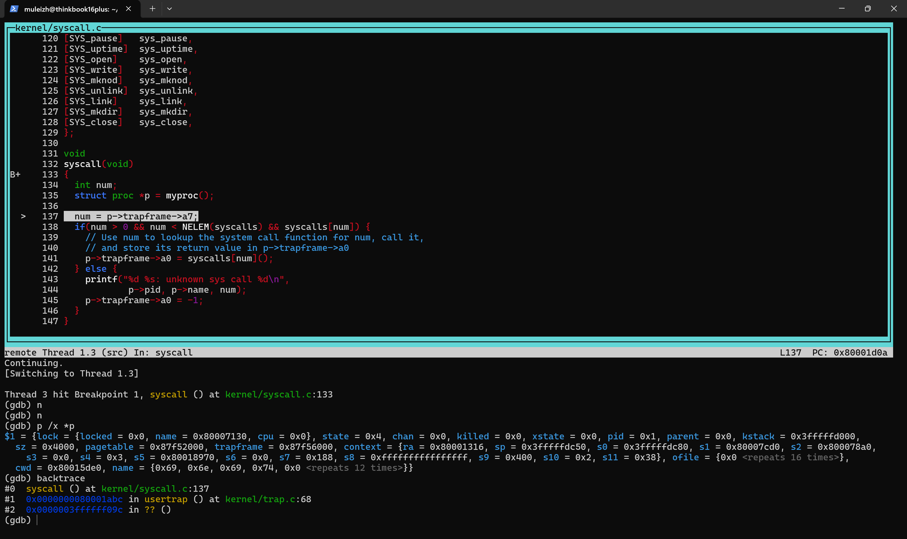
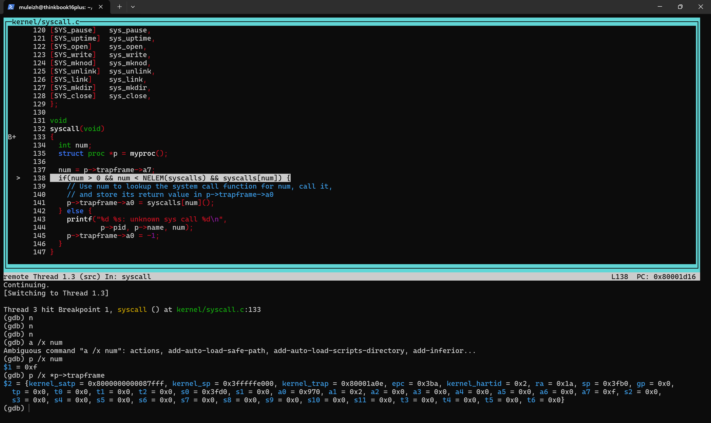
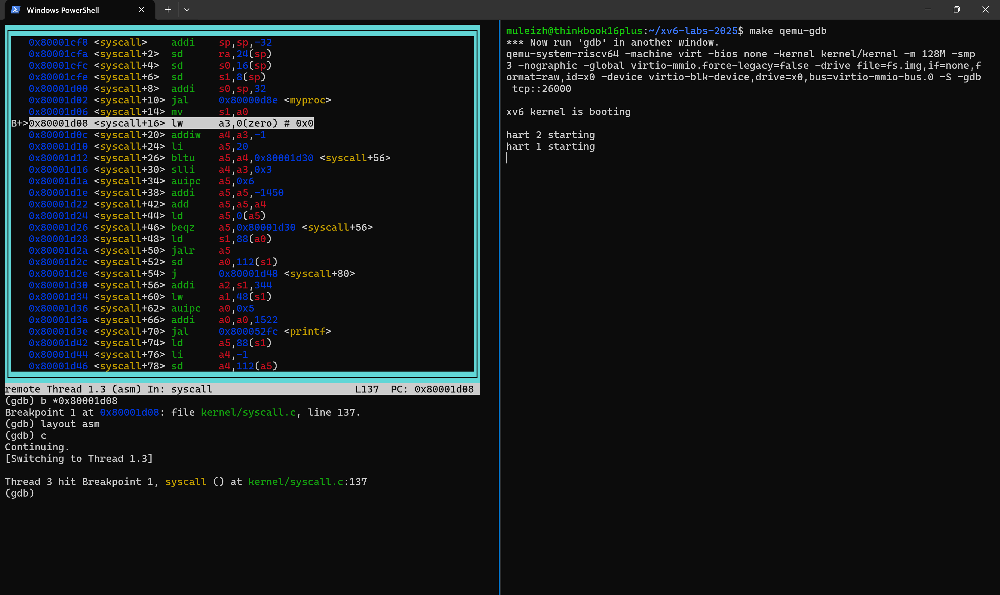
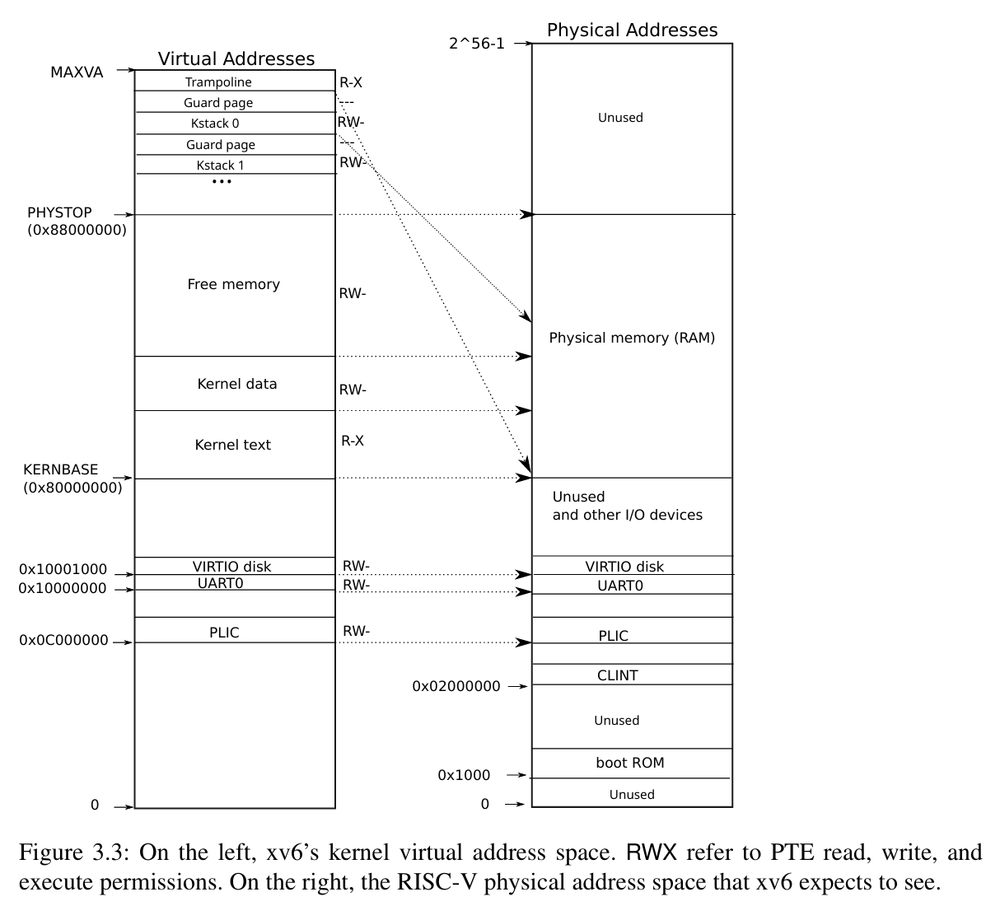
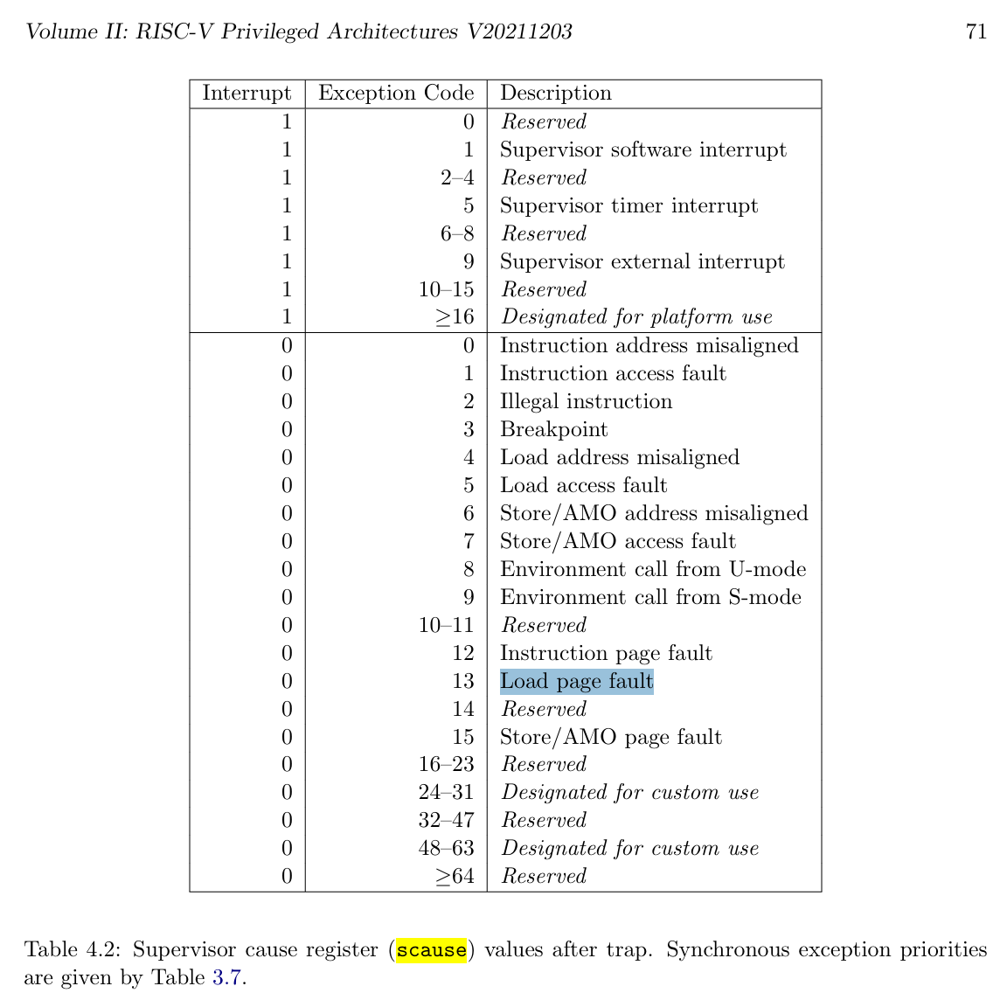
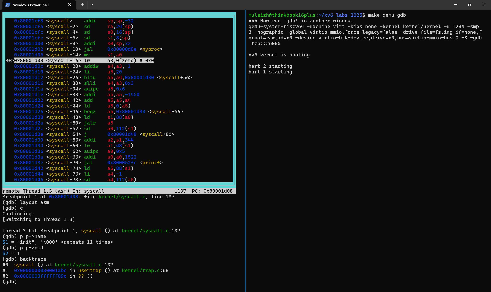

following https://pdos.csail.mit.edu/6.828/2025/labs/syscall.html

# Using gdb
## Set
1. run `make qemu-gdb` in terminal1

2. a.

    run `gdb-multiarch kernel/kernel` in terminal2
   
   `target remote localhost:26000`

    b.
    `gdb-multiarch kernel/kernel -x gdb.txt`

## Commands
* set breakpoint: `b stscall`

* continue: `c`

* next step: `n`

* src: `layout src`

* stack backtrace: `backtrace`

* print something?: `p /x *p`

https://pdos.csail.mit.edu/6.828/2019/lec/gdb_slides.pdf for more

## Q1 Looking at the backtrace output, which function called syscall?



    usertrap() at kernel/trap.c:68

## Q2 What is the value of p->trapframe->a7 and what does that value represent? (Hint: look at user/init.c, the first user program xv6 starts, and its compiled assembly user/init.asm.)



    SYS_open

## Q3 What was the previous mode that the CPU was in?

根据 `sstatus` 寄存器的值 **$3 = 0x200000022**，可以确定 CPU 在进入 Supervisor 模式之前的模式是 **User 模式（User Mode）**。

这是通过查看 `sstatus` 寄存器中的 **SPP（Supervisor Previous Privilege）** 位确定的。

### 解释：SPP 位

在 RISC-V 架构中：

* `sstatus` 寄存器用于控制和报告 Supervisor 模式的状态。
* **SPP** 位（Supervisor Previous Privilege）是 `sstatus` 寄存器的第 **8 位**。
    * 这个位存储了当通过 **`ecall`** 或中断/异常从低权限模式进入 Supervisor 模式时，**进入前的权限模式**。
* 其编码规则是：
    * **SPP = 0**：之前的模式是 **User 模式**。
    * **SPP = 1**：之前的模式是 **Supervisor 模式**。

### 计算和分析

给定的 `sstatus` 值为：
$$0\text{x}200000022$$

1.  将该值转换为二进制（只关注第 8 位）：
    $$\dots\ 0010\ 0000\ 0000\ 0000\ 0000\ 0000\ 0010\ 0010_2$$
2.  定位到 **第 8 位**（从右边 0 开始计数）：
    $$\begin{array}{|c|c|c|c|c|c|c|c|c|c|} \hline \dots & 9 & 8 (\text{SPP}) & 7 & 6 & 5 & 4 & 3 & 2 & 1 & 0 \\ \hline \dots & 0 & \mathbf{0} & 0 & 0 & 0 & 0 & 1 & 0 & 0 & 1 & 0 \\ \hline \end{array}$$
    * **注**：在十六进制中，第 8 位位于倒数第三个数字 `2` (即 $0\text{x}...022$) 的最高位。
    * $0\text{x}2 = 0010_2$. $0\text{x}022$: $\underline{0}\ 001\ \underline{0}\ 001\ \underline{0} 001\ \underline{0} 001\ \dots$
    * $0\text{x}22 = 0010\ 0010_2$.
    * $0\text{x}200000022$. 倒数第三个数字是 **0**。
        * $0\text{x2}2$: $001\mathbf{0\ 0}010_2$.
        * $0\text{x}022$: $0000\ 0010\ 0010_2$.

3.  更清晰地看，十六进制 **0x22** 的二进制表示是 $0010\ 0010_2$。
    * 位 0: 0
    * 位 1: 1
    * 位 2: 0
    * 位 3: 0
    * 位 4: 0
    * 位 5: 0
    * 位 6: 0
    * 位 7: 0
    * **位 8 (SPP): 0**
    * 位 9: 1 (S-Mode 对应的 PIE - Previous Interrupt Enable)

因为 **SPP = 0**，所以 CPU 在进入 Supervisor 模式之前的模式是 **User 模式**。这在 xv6 的 lab 环境中是很常见的，通常是用户进程通过 **`ecall`** 系统调用指令陷入到内核（Supervisor 模式）。


## Q4 Write down the assembly instruction the kernel is panicing at. Which register corresponds to the variable num?

```bash
~/xv6-labs-2025$ make qemu-gdb
*** Now run 'gdb' in another window.
qemu-system-riscv64 -machine virt -bios none -kernel kernel/kernel -m 128M -smp 3 -nographic -global virtio-mmio.force-legacy=false -drive file=fs.img,if=none,format=raw,id=x0 -device virtio-blk-device,drive=x0,bus=virtio-mmio-bus.0 -S -gdb tcp::26000

xv6 kernel is booting

hart 2 starting
hart 1 starting
scause=0xd sepc=0x80001d08 stval=0x0
panic: kerneltrap
```
note: sepc=0x80001d08

find in kernal.asm
```asm
...

void
syscall(void)
{
    80001cf8:	1101                	addi	sp,sp,-32
    80001cfa:	ec06                	sd	ra,24(sp)
    80001cfc:	e822                	sd	s0,16(sp)
    80001cfe:	e426                	sd	s1,8(sp)
    80001d00:	1000                	addi	s0,sp,32
  int num;
  struct proc *p = myproc();
    80001d02:	88cff0ef          	jal	80000d8e <myproc>
    80001d06:	84aa                	mv	s1,a0

  num = * (int *) 0;
    80001d08:	00002683          	lw	a3,0(zero) # 0 <_entry-0x80000000>
  if(num > 0 && num < NELEM(syscalls) && syscalls[num]) {
    80001d0c:	fff6871b          	addiw	a4,a3,-1 # fff <_entry-0x7ffff001>

...
```
note:     80001d08:	00002683          	lw	a3,0(zero) # 0 <_entry-0x80000000>



## Q5 Why does the kernel crash? Hint: look at figure 3-3 in the text; is address 0 mapped in the kernel address space? Is that confirmed by the value in scause above? (See description of scause in RISC-V privileged instructions)



the book fig3-3 says `0x0` is unused



in https://github.com/riscv/riscv-isa-manual/releases/download/Priv-v1.12/riscv-privileged-20211203.pdf says that `scause=0xd` means `Load Page Fault`

## What is the name of the process that was running when the kernel paniced? What is its process id (pid)?



process: init

pid = 1
